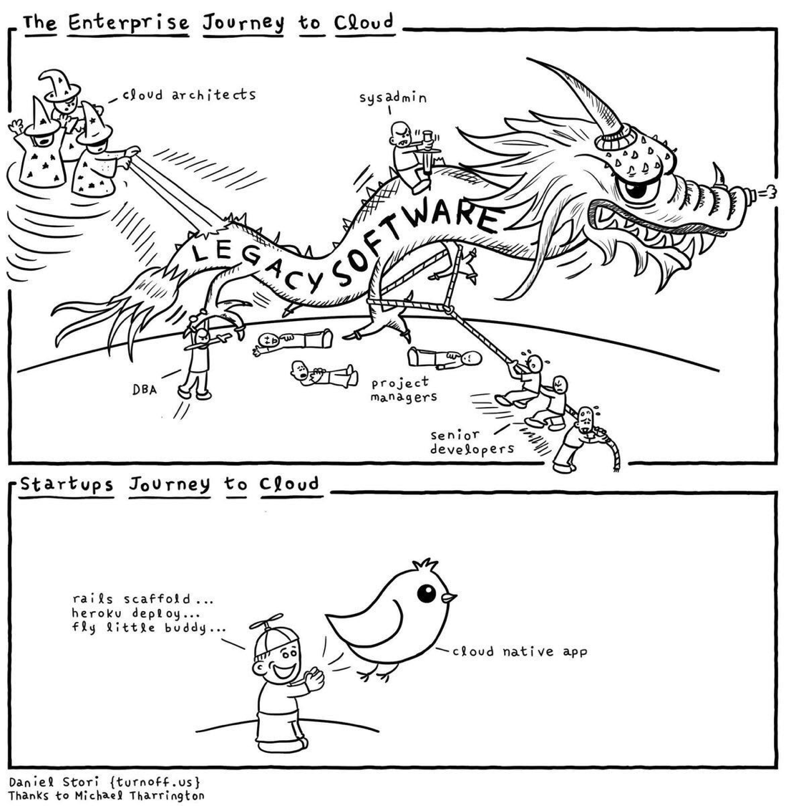

# Introduction to DevOps
##### A From Dockerfiles in GitHub to running apps with Kubernetes Orchestration

+++

#### Current State of Reality

---

#### Session's Agenda

#### 1. Changes in Operations within the Data Center
* Current State
* Future State

#### 2. Changes in Application Development
* 2-Tier Applications
* N-Tier Applications

#### 3. Evolution of the Data Center

#### 4. Tools for the Job
* Code Repository
* Container Framework 
* Container Orchestration Platforms
* Continuous Integration, Development, and Deployment

#### 5. Holistic Overview
