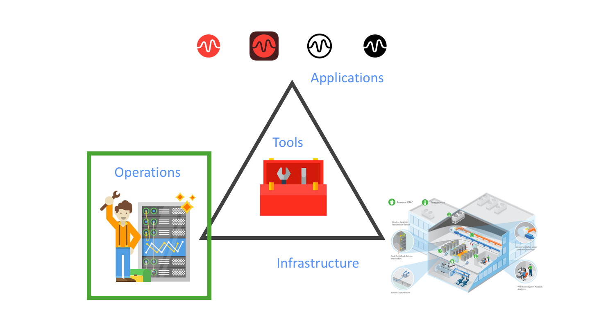

# Introduction to DevOps
##### A From Dockerfiles in GitHub to running apps with Kubernetes Orchestration

+++?image=images/intro/cartoon.png&size=contain

---

Session's            |  Agenda
:-------------------------:|:-------------------------:
  |   Changes in Operations within the Data Center

---

#### Session's Agenda

1 Changes in Operations within the Data Center

  * Current State
  * Future State

+++?image=images/agenda/operations.png&size=contain

#### Session's Agenda

2. Changes in Application Development
  
  * 2-Tier Applications
  * N-Tier Applications

+++

#### Session's Agenda

3. Evolution of the Data Center

+++

#### Session's Agenda

4. Tools for the Job

  * Code Repository
  * Container Framework 
  * Container Orchestration Platforms
  * Continuous Integration, Development, and Deployment

+++
#### Session's Agenda

5. Holistic Overview
